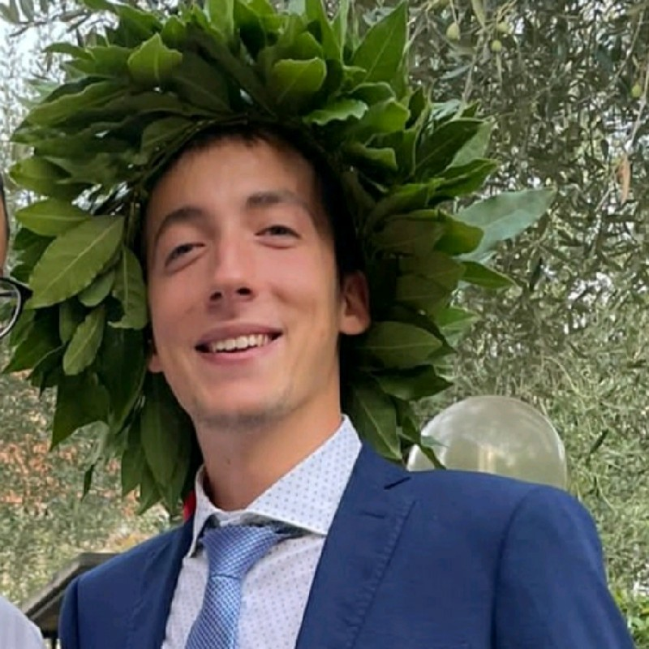

## About me
Marco Mistretta is an AI enthusiast with a solid background in Computer Engineering and Artificial Intelligence. 
He is  currently a PhD student at [MICC](https://www.micc.unifi.it/). 
He has a strong interest in Multimodal Learning, Natural Language Processing, Contrastive Self-Supervised Learning, and Incremental Learning, particularly in the context of healthcare, where these advanced technologies have the potential to significantly enhance medical diagnostics.

## Contact Information
- [LinkedIn](https://www.linkedin.com/in/marco-mistretta-0b02a021a/)
- [Scholar](https://scholar.google.com/citations?hl=it&authuser=4&user=KMIb4eAAAAAJ)
- [Email](marco.mistertta@edu.unifi.it)

